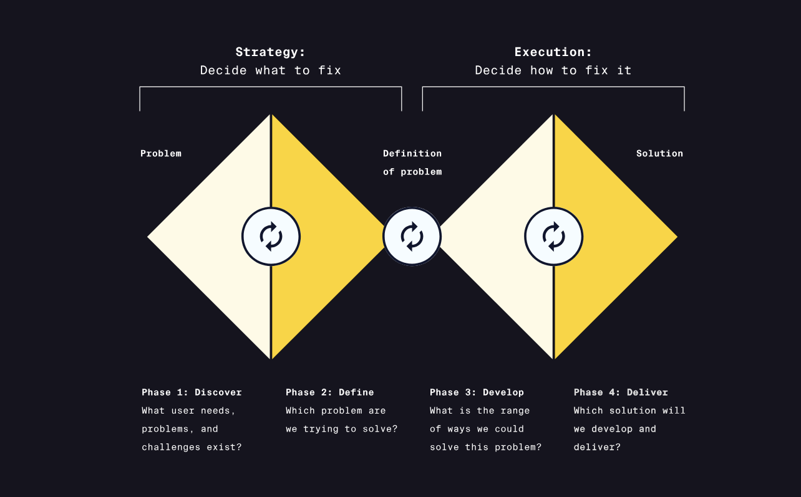

# The Double Diamond model

## A. Definisi
Double diamond ialah proses yang dapat diaplikasikan secara umum untuk cross-functional, iterative design atau proses inovasi. 

Dibagi menjadi dua bagian 

### A.1. convergent thinking
Menganalisis, memfilter, dan fokus pada ide yang menuju keputusan.

### A.2. Divergent thinking
Mengeksplore solusi dan membuat ide

## B. Discover
Mengeksplorasi permasalahan dan landscape. Mempelajari pengguna dan pasar melalui interviews, surveys, dan riset lainnya. 

## C. Define
: Mensortir dan menganalisis informasi yang didapatkan pada tahapan discovery dan mengasah permasalahan yang ingin diselesaikan.

## D. Develop
: Membuat ide untuk solusi melalui brainstorming, workshop, dan low fidelity, purwarupa, dan method ide lainnya. Menguji ide kepada pengguna atau didalam perusahaan dan lihat responsenya.

## E. Deliver
Mengasah, mengembangkan, dan mengirimkan solusi. Untuk melanjutkan evaluasi dan menguji apa yang di kembangkan agar memenuhi kebutuhan pengguna.

