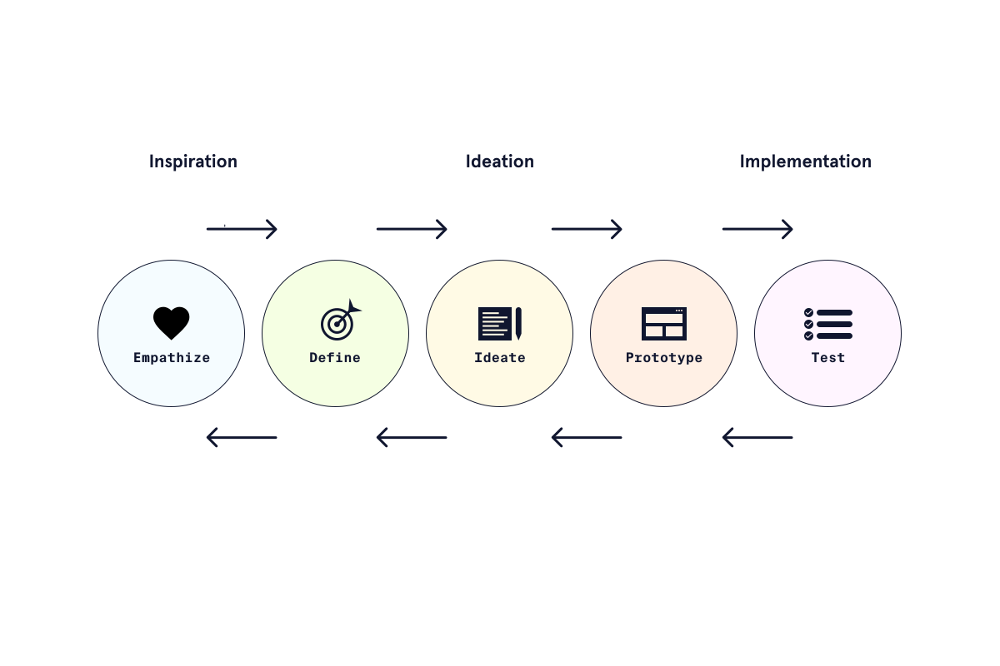

# Design Thinking

## A. Definisi
Design thinking menempatkan penggua pada pusat proses dan mendukung designer untuk menyampingkan asumsi. 

### Contoh Design Thinking
Daripada memikirkan design untuk sikat gigi anak baru, pendekatan design thinking akan mendefinisikan bagaimana car **membersihkan gigi** karena permasalahan tersebut mengeksplore banyak solusi. 

### 5 tahap proses design thinking
1. Emphatize : Mengerti pengguna dan permasalahan
2. Definisi : Mendefinisikan permasalahan dan mensejajarkan tujuan bisnis dan kebutuhan pengguna
3. Ideasi : Membuat ide untuk kemungkinan solusi
4. Purwarupa : Mengeksplorasi potensi solusi dengan membuat purwarupa dari produk dan mengumpulkan feedback
5. Test : Menguji solusi terbaik yang dikembangkan pada tahap purwarupa. 