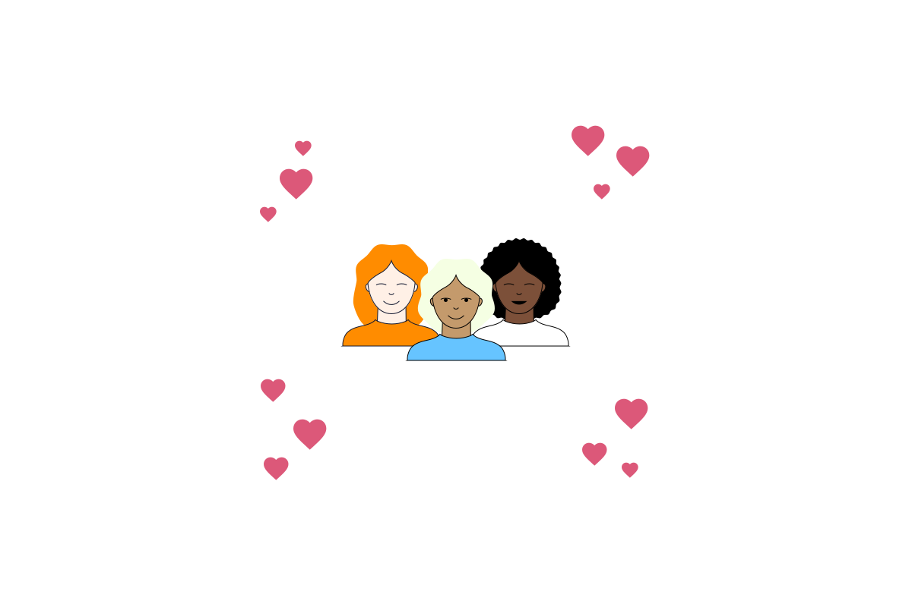

# User Centered Design

## A. Definisi
User centered design menaruh pengguna pada pusat pengembangan produk dan melibatkannya semenjak awa. 

## Iterative process
: Pengguna memberikan feedback dari proses pengembangan sampai rilis. 

## Proses User Centered Design
1. Understand : Berempati terhadap pengguna
2. Menspesifikasi : Mengasah  permasalahan secara spesifik
3. Design : Brainstorming dan  mengembangkan solusi
4. Evaluasi : Menguji produk dan purwarupa untuk mengakses sukses dan memasukan feedback