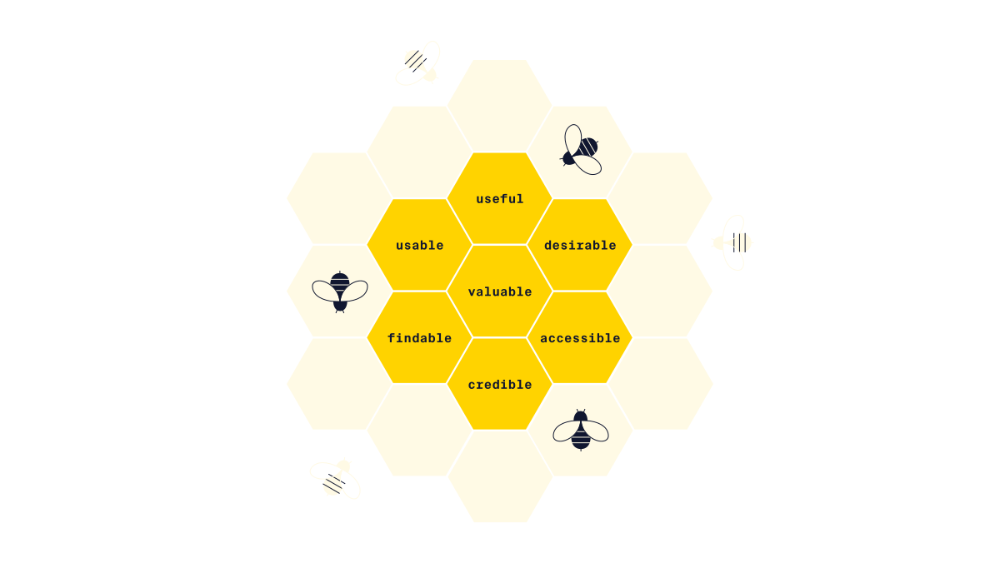

# Defining "Good" UX

## UX Honeycombs
Gambar diatas ialah karya Designer dan Information Architect Peter Morville.

1. useful : Memenuhi kebutuhan pengguna
2. usable : Mudah digunakan dan dimengerti
3. Desirable : Indah secara visual dan 
4. Findable : Mudah untuk menavigasi dan menemukan informasi
5. Accessible : Pengguna dengan disabilitas dapat menggunakan produk
6. Credible : product, perusahaan, dan jasa dapat dipercaya
7. Valuable : Memberikan nilai bisnis

## Google Characteristik of Good user Experience
1. Usable : Fungsionalitas mudah ditemukan dan digunakan
2. Equitable : Bermanfaat untuk individu dengan berbagai background
3. Enjoyable : Senang untuk digunakan 
4. Useful : Menyelesaikan permasalahan pengguna

