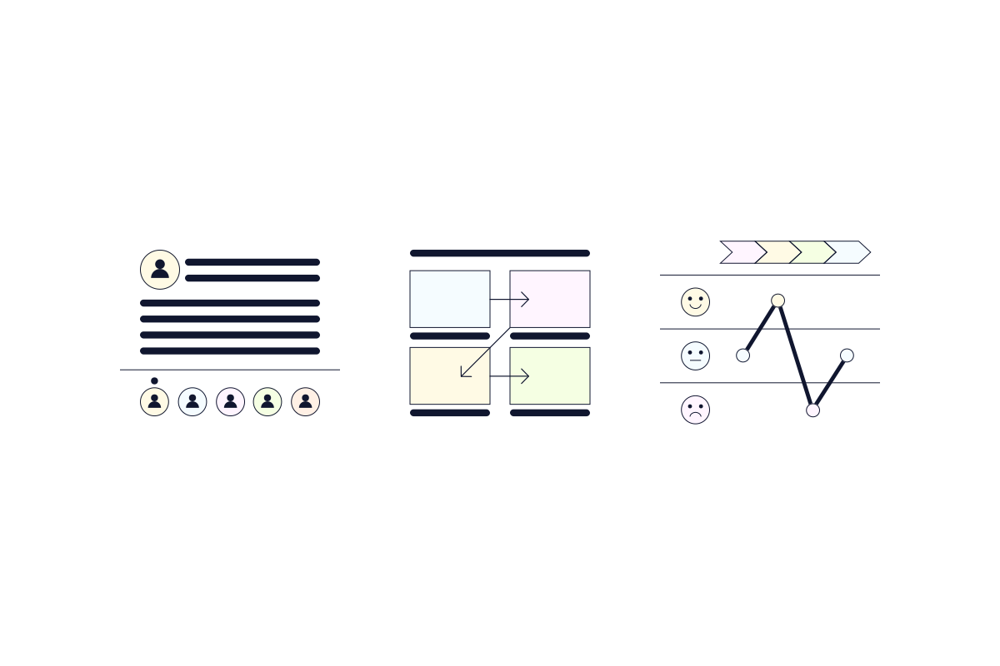

# Introduction to UX Resaearch

User research ialah studi secara sistematik target pengguna produk atau antarmuka untuk memahami perilaku, kebutuhan, dan motivasi pengguna.

## Quantitative Research
* surveys
* analytics
* [A/B Testing](./Istilah/abtesting.md)

## Behavioral Methods
* Interviews
* Focus groups
* [Ethnography](./Istilah/abtesting.md)

