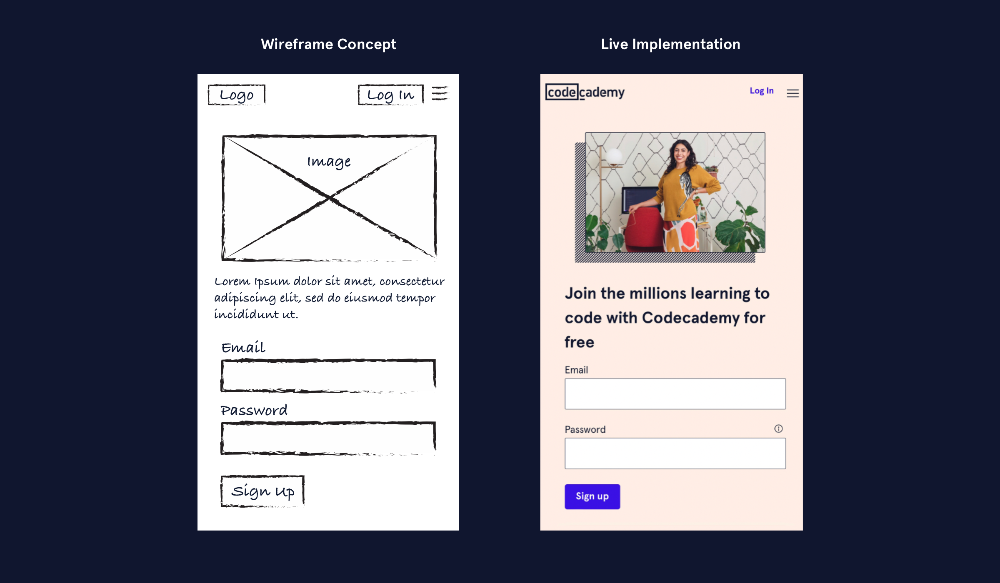
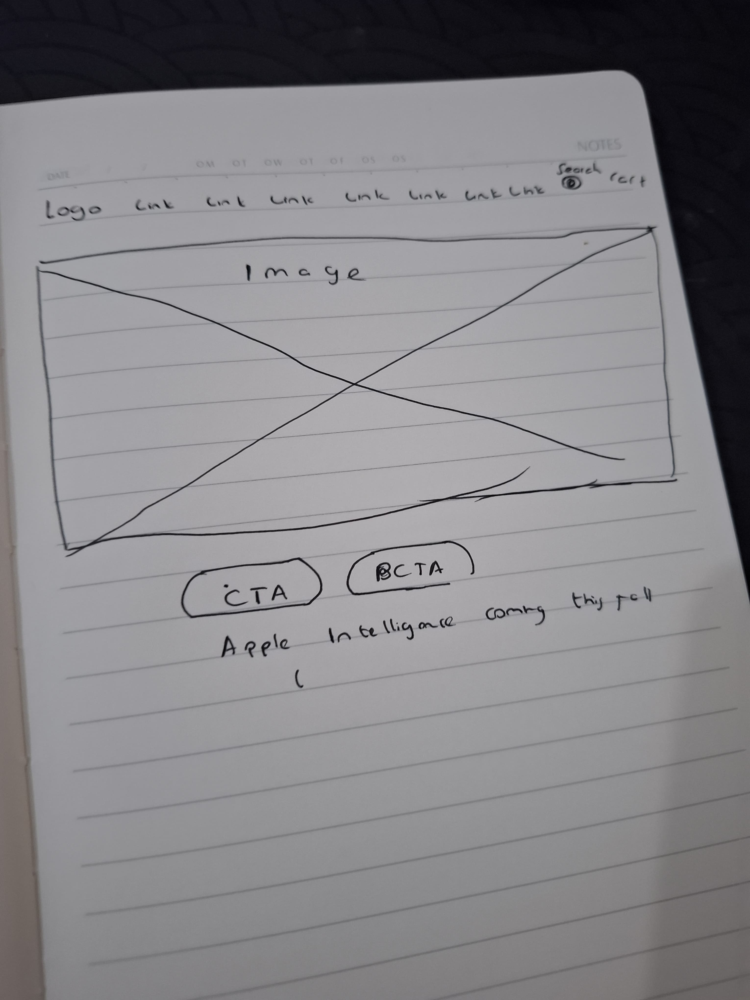

# What is a Wireframe
Wireframe adalah representasi yang[low fidelity](./istilah/low-fidelity.md) dari antarmuka digital. Low fidelity design mungkin tampak seperti gambaran dari pulpen dan kertas. [High fidelity](./istilah/high-fidelity.md) design menggunakan alat digital untuk mencapai qualitas dan detail yang lebih tinggi. 

## Wireframe harus memenuhi
1. Kebutuhan pengguna
2. Tujuan Stakeholder
3. Capabilitas teknis

## Mengapa harus membuat wireframe?
Untuk membangun konten layout sebelum membuat high fidelity design dan pengembangan perangkat lunak. Membangun layout konten membantu mencegah pekerjaan ulang.

## Cara membuat wireframe
Mulai dengan melukis dengan pulpen dan kertas. Melukis mengizinkan kita untuk fokus pada
membuat konsep yang fungsional, intuitive, dan efisien.

## Identifikasi Wireframe website

Menurutku navigasi pada homepage apple terasa begitu sempit

## Alat wireframing
Selain menggunakan pulpen dan kertas kita juga dapat menggunakan aplikasi seperti
1. Figma
2. Adobe XD
3. Sketch
4. Balsamiq

